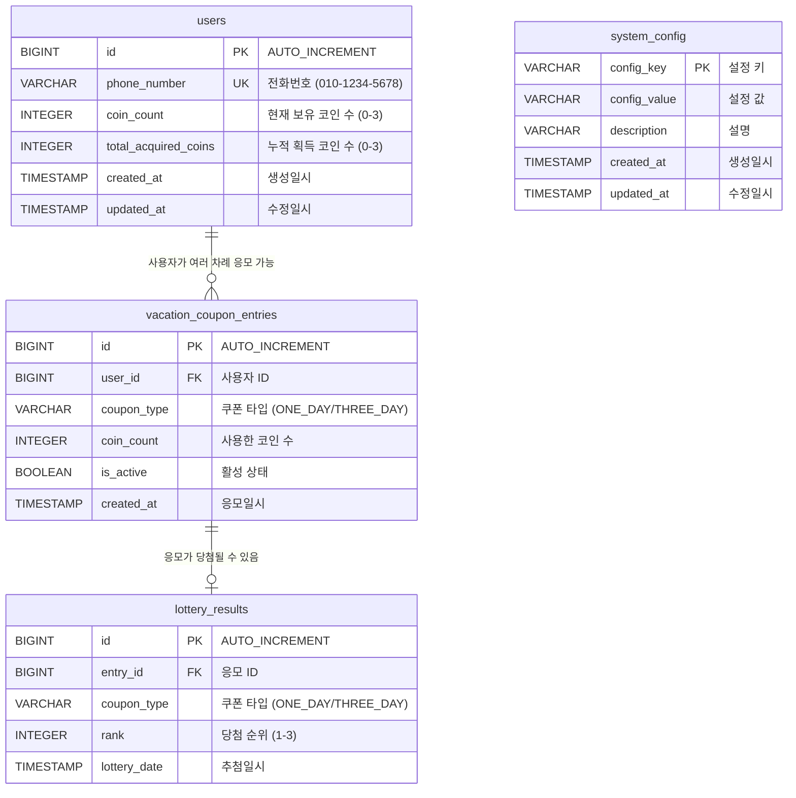

# 휴가 쿠폰 추첨 시스템 - 데이터베이스 스키마

휴가 쿠폰 추첨 시스템의 최종 데이터베이스 스키마를 정의합니다. 
시스템은 Liquibase를 사용하여 데이터베이스 마이그레이션을 관리하지만, 여기에서는 최종적으로 생성되는 DDL문과 테이블 관계를 표기합니다.

## ER Diagram




## 최종 DDL 문

```sql
-- 사용자 테이블 생성 - 전화번호로 식별되는 키다리스튜디오 사원 정보
CREATE TABLE users (
    id BIGINT AUTO_INCREMENT PRIMARY KEY,
    phone_number VARCHAR(20) NOT NULL UNIQUE,
    coin_count INTEGER NOT NULL DEFAULT 0,
    total_acquired_coins INTEGER NOT NULL DEFAULT 0,
    created_at TIMESTAMP NOT NULL DEFAULT CURRENT_TIMESTAMP,
    updated_at TIMESTAMP NOT NULL DEFAULT CURRENT_TIMESTAMP,
    CONSTRAINT chk_users_coin_count_range CHECK (coin_count >= 0 AND coin_count <= 3)
);

-- 인덱스 생성
CREATE INDEX idx_users_phone_number ON users(phone_number);

-- 컬럼 코멘트
COMMENT ON COLUMN users.total_acquired_coins IS '사용자가 지금까지 획득한 총 코인 수 (최대 3개)';


-- 휴가 쿠폰 응모 테이블 생성 - 사용자의 1일권/3일권 응모 내역
CREATE TABLE vacation_coupon_entries (
    id BIGINT AUTO_INCREMENT PRIMARY KEY,
    user_id BIGINT NOT NULL,
    coupon_type VARCHAR(20) NOT NULL,
    coin_count INTEGER NOT NULL,
    is_active BOOLEAN NOT NULL DEFAULT TRUE,
    created_at TIMESTAMP NOT NULL DEFAULT CURRENT_TIMESTAMP,
    CONSTRAINT fk_vacation_coupon_entries_user_id FOREIGN KEY (user_id) REFERENCES users(id) ON DELETE CASCADE,
    CONSTRAINT chk_vacation_coupon_entries_coupon_type CHECK (coupon_type IN ('ONE_DAY', 'THREE_DAY')),
    CONSTRAINT chk_vacation_coupon_entries_coin_count CHECK (coin_count > 0)
);

-- 인덱스 생성
CREATE INDEX idx_vacation_coupon_entries_user_id ON vacation_coupon_entries(user_id);
CREATE INDEX idx_vacation_coupon_entries_coupon_type ON vacation_coupon_entries(coupon_type);
CREATE INDEX idx_vacation_coupon_entries_is_active ON vacation_coupon_entries(is_active);


-- 추첨 결과 테이블 생성 - 당첨자 정보 및 추첨 결과 저장
CREATE TABLE lottery_results (
    id BIGINT AUTO_INCREMENT PRIMARY KEY,
    entry_id BIGINT NOT NULL,
    coupon_type VARCHAR(20) NOT NULL,
    rank INTEGER NOT NULL,
    lottery_date TIMESTAMP NOT NULL DEFAULT CURRENT_TIMESTAMP,
    CONSTRAINT fk_lottery_results_entry_id FOREIGN KEY (entry_id) REFERENCES vacation_coupon_entries(id) ON DELETE CASCADE,
    CONSTRAINT chk_lottery_results_coupon_type CHECK (coupon_type IN ('ONE_DAY', 'THREE_DAY')),
    CONSTRAINT chk_lottery_results_rank CHECK (rank >= 1 AND rank <= 3)
);

-- 인덱스 생성
CREATE INDEX idx_lottery_results_entry_id ON lottery_results(entry_id);
CREATE INDEX idx_lottery_results_coupon_type ON lottery_results(coupon_type);
CREATE INDEX idx_lottery_results_rank ON lottery_results(rank);


-- 시스템 설정 테이블 생성 - 전체 코인 수량, 당첨자 수 등 시스템 설정값 관리
CREATE TABLE system_config (
    config_key VARCHAR(50) PRIMARY KEY,
    config_value VARCHAR(255) NOT NULL,
    description VARCHAR(500),
    created_at TIMESTAMP NOT NULL DEFAULT CURRENT_TIMESTAMP,
    updated_at TIMESTAMP NOT NULL DEFAULT CURRENT_TIMESTAMP
);

-- 초기 설정값 삽입
INSERT INTO system_config (config_key, config_value, description) VALUES
('TOTAL_COINS', '900', '전체 응모 코인 수량'),
('REMAINING_COINS', '900', '남은 응모 코인 수량'),
('MAX_COINS_PER_USER', '3', '사용자당 최대 응모 코인 수'),
('WINNERS_PER_COUPON', '3', '쿠폰당 당첨자 수');

```


### 1. 사용자 테이블 (users)

- 키다리스튜디오 직원들의 기본 정보를 저장
- 전화번호를 고유 식별자로 사용
- 현재 보유 코인 수와 누적 획득 코인 수를 별도 관리
- 개인당 최대 3개까지 코인 보유 가능

### 2. 휴가 쿠폰 응모 테이블 (vacation_coupon_entries)

- 사용자의 휴가 쿠폰 응모 내역을 저장
- ONE_DAY(1일권), THREE_DAY(3일권) 두 가지 쿠폰 타입 지원
- 응모 시 사용한 코인 수를 기록 (더 많은 코인 사용 시 당첨 확률 증가)
- is_active 플래그로 응모 취소 관리

### 3. 추첨 결과 테이블 (lottery_results)

- 추첨 완료 후 당첨자 정보를 저장
- 각 쿠폰 타입별로 1등, 2등, 3등 총 3명의 당첨자
- Fisher-Yates 셔플 알고리즘을 통한 공정한 추첨 결과 저장

### 4. 시스템 설정 테이블 (system_config)

- 시스템 전반의 설정값을 Key-Value 형태로 저장
- 전체 코인 수량, 사용자당 최대 코인 수, 당첨자 수 등을 동적으로 관리
- 설정 변경 시 애플리케이션 재시작 없이 반영 가능


## 테이블 관계 설명

### 1. users ↔ vacation_coupon_entries (1:N)
- 한 사용자는 여러 번 응모할 수 있음
- 같은 쿠폰 타입에 여러 번 응모 가능 (코인이 있는 경우)
- 사용자 삭제 시 관련 응모 내역도 함께 삭제 (CASCADE)

### 2. vacation_coupon_entries ↔ lottery_results (1:0..1)
- 응모 내역 중 당첨된 경우에만 추첨 결과 레코드 생성
- 응모 삭제 시 관련 추첨 결과도 함께 삭제 (CASCADE)

### 3. system_config (독립 테이블)
- 다른 테이블과 직접적인 외래키 관계 없음
- 애플리케이션 로직에서 설정값 참조


## 인덱스 설정 이유

1. **users.phone_number**: 전화번호 기반 사용자 조회 최적화
2. **vacation_coupon_entries.user_id**: 사용자별 응모 내역 조회 최적화
3. **vacation_coupon_entries.coupon_type**: 쿠폰 타입별 통계 조회 최적화
4. **vacation_coupon_entries.is_active**: 활성 응모 내역 필터링 최적화
5. **lottery_results.entry_id**: 응모별 당첨 결과 조회 최적화
6. **lottery_results.coupon_type**: 쿠폰 타입별 당첨자 조회 최적화
7. **lottery_results.rank**: 순위별 당첨자 조회 최적화

## 데이터 무결성

### 제약 조건 (Constraints)
1. **사용자 코인 수 제한**: 0~3개 범위 내에서만 보유 가능
2. **쿠폰 타입 제한**: ONE_DAY, THREE_DAY만 허용
3. **응모 코인 수 제한**: 1개 이상만 사용 가능
4. **당첨 순위 제한**: 1~3등만 허용
5. **외래키 제약**: 참조 무결성 보장 및 CASCADE 삭제

### 트랜잭션 관리
- 코인 획득/사용 시 동시성 제어
- 응모/취소 시 원자성 보장
- 추첨 실행 시 일관성 유지